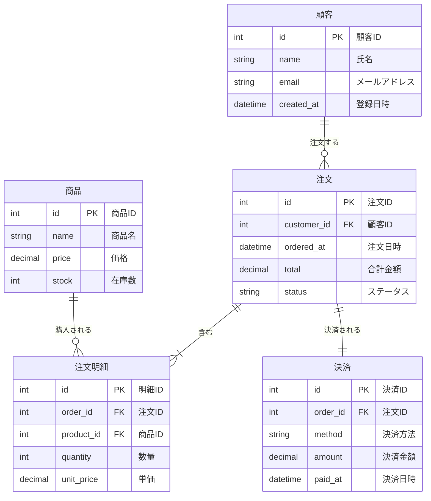

# layout.labels廃止 — Mermaid標準 `["..."]` 構文に一本化

> **For agentic workers:** REQUIRED SUB-SKILL: Use superpowers:subagent-driven-development (recommended) or superpowers:executing-plans to implement this plan task-by-task. Steps use checkbox (`- [ ]`) syntax for tracking.

**Goal:** layout.jsonの独自`labels`フィールドを廃止し、Mermaid標準の`ENTITY["日本語名"]`構文をラベルの唯一の情報源にする

**Architecture:** rendererの`resolveLabel`からlayout.labels参照を削除し、entity.label（パーサーが.mmdから読み取る値）のみを使用する。MCP save-layoutのlabelsパラメータも削除。ブラウザUIのlabel-editorはentity.labelの読み取り専用表示に変更。

**Tech Stack:** TypeScript, Zod, Vitest

---

## File Map

| File | Action | Responsibility |
|------|--------|---------------|
| `src/client/renderer.ts` | Modify | `resolveLabel`をentity.labelのみに、`render()`からlabelsパラメータ削除 |
| `src/client/main.ts` | Modify | 全`render()`呼び出しからlabels引数削除、label-editor→読み取り専用化、layout-changedからlabels同期削除 |
| `src/client/label-editor.ts` | Modify | layout.labels読み書き→entity.label読み取り専用表示に変更 |
| `src/client/search.ts` | Modify | layout.labels参照→entity.label参照に変更 |
| `src/mcp-server.ts` | Modify | save-layoutからlabelsパラメータ削除、説明文更新 |
| `src/server/layout-schema.ts` | Modify | labelsフィールド削除 |
| `src/server/layout-store.ts` | Modify | SCHEMA_METAからlabels関連削除 |
| `src/parser/types.ts` | Modify | LayoutData.labels削除 |
| `src/__tests__/layout-schema.test.ts` | Modify | labelsテストケース更新 |
| `examples/sample.mmd` | Modify | `["..."]`構文でラベル追加 |
| `examples/sample.mmd.layout.json` | Modify | labelsフィールド削除 |
| `CLAUDE.md` | Modify | 方針を`["..."]`構文使用に更新 |

---

### Task 1: renderer.ts — labels依存を除去

**Files:**
- Modify: `src/client/renderer.ts:35` (labelsフィールド)
- Modify: `src/client/renderer.ts:108-111` (resolveLabel)
- Modify: `src/client/renderer.ts:157-169` (render signature)

- [ ] **Step 1: resolveLabel をentity.labelのみに変更**

`src/client/renderer.ts` の `resolveLabel` メソッド（109-111行目）を変更:

```typescript
  /** Entity.label（.mmd の ["..."] 構文）をそのまま返す */
  private resolveLabel(entity: Entity): string {
    return entity.label || '';
  }
```

- [ ] **Step 2: labelsプライベートフィールドを削除**

`src/client/renderer.ts` 35行目の `private labels: Record<string, string> = {};` を削除。

- [ ] **Step 3: render() シグネチャからlabelsパラメータを削除**

`src/client/renderer.ts` の `render` メソッド（157-169行目）を変更:

```typescript
  render(
    diagram: ERDiagramJSON,
    positions: Record<string, { x: number; y: number }>,
    groups?: LayoutData['groups'],
  ): void {
    if (diagram !== this.diagram) {
      this.measurementCache.clear();
    }
    this.diagram = diagram;
    this.groups = groups;
    this.buildRelationshipIndex(diagram.relationships);
    // ... 以降は同じ
```

- [ ] **Step 4: ビルド確認**

Run: `npm run build`
Expected: コンパイルエラー（main.tsで古いrender()呼び出しが残っているため）。これはTask 2で修正する。

- [ ] **Step 5: コミット（renderer.ts単体）**

```bash
git add src/client/renderer.ts
git commit -m "refactor: renderer.tsからlayout.labels依存を削除

resolveLabel()をentity.labelのみに変更し、render()のlabelsパラメータを削除"
```

---

### Task 2: main.ts — 全render()呼び出しからlabels引数を削除

**Files:**
- Modify: `src/client/main.ts:151,224,246,275,286,296,421,568,828`

- [ ] **Step 1: 全render()呼び出しを一括更新**

`src/client/main.ts` の以下の全箇所で `layout.labels` 引数を削除し、`layout.groups` を3番目の引数にする:

151行目 (loadAndRender):
```typescript
    renderer.render(diagram, activeEntities(), layout.groups);
```

224行目 (labelEditorDeps.rerender):
```typescript
      renderer.render(diagram, activeEntities(), layout?.groups);
```

246行目 (handleCompactToggle):
```typescript
  renderer.render(diagram, positions, layout.groups);
```

275行目 (handleAutoLayout):
```typescript
  renderer.render(diagram, activeEntities(), layout.groups);
```

286行目 (handleUndo):
```typescript
  renderer.render(diagram, activeEntities(), layout.groups);
```

296行目 (handleRedo):
```typescript
  renderer.render(diagram, activeEntities(), layout.groups);
```

421行目 (changeFontScale):
```typescript
    renderer.render(diagram, activeEntities(), layout.groups);
```

568行目 (rerenderAll):
```typescript
    renderer.render(diagram, activeEntities(), layout.groups);
```

828行目 (layout-changed handler):
```typescript
      renderer.render(diagram, activeEntities(), layout.groups);
```

- [ ] **Step 2: layout-changedハンドラからlabels同期を削除**

`src/client/main.ts` 816行目の `layout.labels = diskLayout.labels;` を削除。

- [ ] **Step 3: ビルド確認**

Run: `npm run build`
Expected: SUCCESS（label-editor.tsの型エラーがあるかもしれないが、labelsはまだtypes.tsに残っているので通るはず）

- [ ] **Step 4: コミット**

```bash
git add src/client/main.ts
git commit -m "refactor: main.tsの全render()呼び出しからlabels引数を削除"
```

---

### Task 3: label-editor.ts — 読み取り専用化

**Files:**
- Modify: `src/client/label-editor.ts`

- [ ] **Step 1: label-editor.tsを読み取り専用に書き換え**

`src/client/label-editor.ts` を以下に変更。エンティティのダブルクリックでentity.labelを表示するだけにする。編集はできず、「.mmdファイルで編集してください」と案内する:

```typescript
import type { ERDiagramJSON } from '../parser/types.js';

export interface LabelEditorDeps {
  getDiagram: () => ERDiagramJSON | null;
  getSvg: () => SVGSVGElement;
  getZoom: () => number;
  getPanX: () => number;
  getPanY: () => number;
  getEntityRect: (name: string) => { x: number; y: number; width: number; height: number } | null;
}

export function showLabelEditor(deps: LabelEditorDeps, entityName: string): void {
  // 既に開いている場合は閉じる
  document.getElementById('label-editor')?.remove();

  const svg = deps.getSvg();
  const svgRect = svg.getBoundingClientRect();
  const entityRect = deps.getEntityRect(entityName);
  const diagram = deps.getDiagram();
  if (!entityRect || !diagram) return;

  const entity = diagram.entities[entityName];
  const currentLabel = entity?.label || '';

  // SVG座標 → 画面座標
  const zoom = deps.getZoom();
  const panX = deps.getPanX();
  const panY = deps.getPanY();
  const screenX = entityRect.x * zoom + panX + svgRect.left;
  const screenY = entityRect.y * zoom + panY + svgRect.top;
  const screenW = entityRect.width * zoom;

  const input = document.createElement('input');
  input.type = 'text';
  input.id = 'label-editor';
  input.value = currentLabel;
  input.placeholder = '.mmd ファイルで ENTITY["ラベル"] を編集';
  input.readOnly = true;
  input.style.position = 'fixed';
  input.style.left = `${screenX}px`;
  input.style.top = `${screenY}px`;
  input.style.width = `${Math.max(screenW, 200)}px`;

  document.body.appendChild(input);
  input.focus();
  input.select();

  function close(): void {
    input.remove();
  }

  input.addEventListener('keydown', (e) => {
    if (e.key === 'Escape' || e.key === 'Enter') { e.preventDefault(); close(); }
  });
  input.addEventListener('blur', () => close());
}
```

- [ ] **Step 2: main.tsのlabelEditorDepsを更新**

`src/client/main.ts` の `labelEditorDeps`（213-228行目）を新しいインターフェースに合わせる:

```typescript
// Label editor deps (lazy — uses current state at call time)
const labelEditorDeps = {
  getDiagram: () => diagram,
  getSvg,
  getZoom: () => pz.zoom,
  getPanX: () => pz.panX,
  getPanY: () => pz.panY,
  getEntityRect: (name: string) => renderer.getEntityRect(name),
};
```

- [ ] **Step 3: ビルド確認**

Run: `npm run build`
Expected: SUCCESS

- [ ] **Step 4: コミット**

```bash
git add src/client/label-editor.ts src/client/main.ts
git commit -m "refactor: label-editorをentity.labelの読み取り専用表示に変更

layout.labelsへの読み書きを廃止。ダブルクリックで現在のラベルを表示し、
編集は.mmdファイルで行うよう案内する。"
```

---

### Task 4: search.ts — layout.labels参照をentity.labelに変更

**Files:**
- Modify: `src/client/search.ts:36`

- [ ] **Step 1: search.tsのラベル参照を変更**

`src/client/search.ts` 36行目を変更:

```typescript
    const label = entity.label || '';
```

- [ ] **Step 2: ビルド確認**

Run: `npm run build`
Expected: SUCCESS

- [ ] **Step 3: コミット**

```bash
git add src/client/search.ts
git commit -m "refactor: search.tsのラベル検索をentity.labelに変更"
```

---

### Task 5: MCP save-layout — labelsパラメータ削除

**Files:**
- Modify: `src/mcp-server.ts:108-141`

- [ ] **Step 1: save-layoutツールからlabels関連を削除**

`src/mcp-server.ts` の save-layout ツール（108-141行目）を変更:

```typescript
// --- ツール: レイアウト保存 ---
server.tool(
  'save-layout',
  'ER図のレイアウトデータ（エンティティ位置）を保存する',
  {
    filePath: z.string().describe('.mmdファイルの絶対パス'),
    entities: z
      .record(z.string(), z.object({ x: z.number(), y: z.number() }))
      .optional()
      .describe('エンティティの位置（例: {"users": {"x": 100, "y": 200}}）'),
  },
  async ({ filePath, entities }) => {
    const absPath = resolve(filePath);
    if (!existsSync(absPath)) {
      return { content: [{ type: 'text' as const, text: `Error: ファイルが見つかりません: ${absPath}` }], isError: true };
    }

    const store = new LayoutStore(absPath);
    const source = readFileSync(absPath, 'utf-8');
    let layout = store.load() || store.createDefault(source);

    if (entities) {
      layout.entities = { ...layout.entities, ...entities };
    }

    store.save(layout);
    return { content: [{ type: 'text' as const, text: 'レイアウトを保存しました: ' + store.getLayoutPath() }] };
  },
);
```

- [ ] **Step 2: get-layoutツールの説明文からラベルを削除**

`src/mcp-server.ts` 89行目の get-layout ツールの説明を変更:

```typescript
  'ER図のレイアウトデータ（エンティティ位置、キャンバス状態）をJSONで返す',
```

- [ ] **Step 3: ビルド確認**

Run: `npm run build`
Expected: SUCCESS

- [ ] **Step 4: コミット**

```bash
git add src/mcp-server.ts
git commit -m "refactor: MCP save-layoutからlabelsパラメータを削除

エンティティの日本語名は.mmdファイルのMermaid標準構文 ENTITY[\"ラベル\"] で管理する方針に変更"
```

---

### Task 6: スキーマ・型定義からlabels削除

**Files:**
- Modify: `src/server/layout-schema.ts:20`
- Modify: `src/parser/types.ts:43`
- Modify: `src/server/layout-store.ts:9-29`

- [ ] **Step 1: layout-schema.tsからlabelsフィールド削除**

`src/server/layout-schema.ts` 20行目の `labels: z.record(z.string(), z.string()).optional(),` を削除。

- [ ] **Step 2: types.tsからLabelsフィールド削除**

`src/parser/types.ts` 43行目の `labels?: Record<string, string>;` を削除。

- [ ] **Step 3: layout-store.tsのSCHEMA_METAからlabels関連を削除**

`src/server/layout-store.ts` の SCHEMA_META から以下を削除:
- 17行目: `labels` フィールドの説明
- 23-28行目: `labels_example` 全体

変更後のSCHEMA_META:
```typescript
  private static readonly SCHEMA_META = {
    description: 'Mermaid ER Viewer layout file',
    fields: {
      version: 'number — schema version (currently 1)',
      diagramFile: 'string — source .mmd filename',
      contentHash: 'string — hash of diagram content for change detection',
      canvas: '{ panX, panY, zoom } — viewport state for normal mode',
      entities: 'Record<entityName, { x, y }> — entity positions for normal mode',
      compactEntities: 'Record<entityName, { x, y }> — entity positions for compact mode',
      compactCanvas: '{ panX, panY, zoom } — viewport state for compact mode',
    },
    notes: {
      entityLabels: 'エンティティの日本語名は .mmd ファイル内で Mermaid標準の ENTITY["ラベル"] 構文を使用してください',
      relationshipLabels: 'リレーションのラベル（日本語名など）は .mmd ファイル内に直接記述してください。例: USERS ||--o{ ORDERS : "注文する"',
    },
  };
```

- [ ] **Step 4: テスト更新**

`src/__tests__/layout-schema.test.ts` の「オプショナルフィールド付きデータを受け入れる」テスト（18-27行目）から `labels` を削除:

```typescript
  it('オプショナルフィールド付きデータを受け入れる', () => {
    const data = {
      ...validLayout,
      compactEntities: { USERS: { x: 50, y: 50 } },
      compactCanvas: { panX: 10, panY: 10, zoom: 0.5 },
    };
    const result = layoutDataSchema.safeParse(data);
    expect(result.success).toBe(true);
  });
```

- [ ] **Step 5: テスト実行**

Run: `npx vitest run`
Expected: ALL PASS

- [ ] **Step 6: ビルド確認**

Run: `npm run build`
Expected: SUCCESS

- [ ] **Step 7: コミット**

```bash
git add src/server/layout-schema.ts src/parser/types.ts src/server/layout-store.ts src/__tests__/layout-schema.test.ts
git commit -m "refactor: スキーマ・型定義からlabelsフィールドを削除"
```

---

### Task 7: sample.mmd を ["..."] 構文に移行

**Files:**
- Modify: `examples/sample.mmd`
- Modify: `examples/sample.mmd.layout.json`

- [ ] **Step 1: sample.mmdにラベル構文を追加**

`examples/sample.mmd` のエンティティ定義に `["..."]` 構文を追加:



- [ ] **Step 2: sample.mmd.layout.jsonからlabelsを削除**

`examples/sample.mmd.layout.json` から `"labels": { ... }` ブロックを削除。

- [ ] **Step 3: パーサーテスト実行**

Run: `npx vitest run`
Expected: ALL PASS

- [ ] **Step 4: コミット**

```bash
git add examples/sample.mmd examples/sample.mmd.layout.json
git commit -m "migrate: sample.mmdのラベルをlayout.jsonからMermaid標準構文に移行"
```

---

### Task 8: CLAUDE.md 方針更新

**Files:**
- Modify: `CLAUDE.md`

- [ ] **Step 1: .mmdファイルの原則セクションを更新**

`CLAUDE.md` の「.mmdファイルの原則」セクション（現在33-38行目付近）を以下に変更:

```markdown
## .mmdファイルの原則
- **Mermaid標準のER図構文のみ使用すること**。独自拡張構文を書き込まない
- エンティティの日本語名は Mermaid標準の `["..."]` 構文を使う: `USERS["ユーザー"] {`
- このツールはClaude Codeが標準Mermaidを理解・閲覧するための補助ツール
- .mmdファイルは他のMermaidツール（公式Live Editor等）でも開ける状態を維持する
```

- [ ] **Step 2: 実装上の注意セクションを更新**

layout.labelsに関する記述を削除・更新:

```markdown
## 実装上の注意
- サーバーは .mmd を読み取り専用。書き込むのは .layout.json のみ
- Entity.label（.mmd の ["..."] 構文）がエンティティの日本語名の唯一の情報源
- layout.json にはラベル情報を保存しない（位置・キャンバス状態のみ）
- PUT /api/layout 後は必ず WebSocket で layout-changed をブロードキャストする
- file-changed 時は flushSaveLayout() で未保存レイアウトを先に保存してから再読み込み
- fetch API には cache: 'no-store' を付けてブラウザキャッシュを回避する
```

- [ ] **Step 3: コミット**

```bash
git add CLAUDE.md
git commit -m "docs: CLAUDE.mdの方針をMermaid標準ラベル構文に更新"
```

---

### Task 9: 最終ビルド・テスト検証

- [ ] **Step 1: テスト実行**

Run: `npx vitest run`
Expected: ALL PASS

- [ ] **Step 2: ビルド確認**

Run: `npm run build`
Expected: SUCCESS（エラーなし）

- [ ] **Step 3: 動作確認**

Run: `npm run dev -- examples/sample.mmd`
Expected: ブラウザでsample.mmdが表示され、各エンティティに日本語名（顧客、商品、注文など）が表示される

- [ ] **Step 4: 全変更をまとめてプッシュ準備確認**

Run: `git log --oneline -10`
Expected: Task 1-8の各コミットが確認できる
